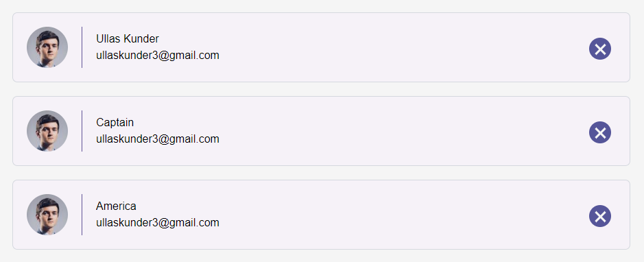

# React

Lets learn building large react app by building smaller react components and then composing them together

React uses JavaScript Object to buid UI interface

- Using **create-react-app** command
- create-react-app quickly setup projects without configuring, so you do not have to setup your project by yourself.
  - Using npm or npx: `npx create-react-app project-name`
  - This will install mainly `react`, `react-dom` and `react-script`
    - `react-script` setup **babel** (for js syntax), **webpack**, **dev-server** (auto reload functionality)

OR

- Creating react app from scratch

## Complete react from scratch

- Create folder structure

```cmd
react-proj
|
├───public
│   |└───script
|   |    └─── app.js
|   └─── index.html
|
└───src
    └─── index.js

```

We will need `live-server`

This is a little development server with live reload capability
You should probably install this globally by using `-g` flag.

```bash
npm install -g live-server
```

- Create `index.js` in `src` folder where we write all the react code

- Create `index.html` & `script` folder inside public folder, Add app.js in script folder

- Last do => `npm install` with package.json it will install all the required dependencies

- In the `src` /index.js add this basic code

```jsx
const template = <h1>Heading</h1>;

ReactDOM.render(template, document.getElementById("app"));
```

## Compiling the file

- We are telling babel that we have written react code in src\index.js and out file to public\srcipt\app.js

- We will use presets env, react :
  Babel preset-env is a preset that compiles down to a minimum of ES5 ( preset-es2015 )

- To compile a file every time that you change it, use the `--watch` or `-w`

  - In the `ps OR cmd` start `babel` by

    ```ps
    ❯ babel .\src\index.js --out-file=public\script\app.js --presets=env,react --watch
    ```

  - In the `bash` start `babel` by

    ```bash
    babel src/index.js --out-file=public/script/app.js --presets=env,react --watch
    ```

## Live server

open another terminal `execute the command to to run the file`

```bash
live-server public/
```

## Component

- Components let you split the UI into independent, reusable pieces, and think about each piece in isolation.

- Conceptually, components are like JavaScript functions.

ES6 class to define a component:

```jsx
class Welcome extends React.Component {
  render() {
    return <h1>Hello</h1>;
  }
}
```

Example. 1

```jsx
class NameList extends React.Component {
  render() {
    const people = [{ name: "ullas" }, { name: "kunder" }, { name: "Villas" }];
    return (
      <ul>
        {people.map((person) => (
          <li key={person.name}>{person.name}</li>
        ))}
      </ul>
    );
  }
}

ReactDOM.render(<NameList />, document.getElementById("app"));
```

Example. 1.1

```jsx
class Header extends React.Component {
  render() {
    return (
      <div>
        <h1>Header Component</h1>
      </div>
    );
  }
}

class NameList extends React.Component {
  render() {
    const people = [
      { name: "Ullas" },
      { name: "Captain" },
      { name: "America" },
    ];
    return (
      <ul>
        <p>List Component</p>

        {people.map((person) => (
          <li key={person.name}>{person.name.toUpperCase()}</li>
        ))}
      </ul>
    );
  }
}
// creating button component
class Button extends React.Component {
  render() {
    return <button>Add</button>;
  }
}

ReactDOM.render(<App />, document.getElementById("app"));
```

## Nesting Components

Example. 2

```js
class App extends React.Component {
  render() {
    return (
      <div>
        <Header />

        <NameList />
        {/* react components are reusabe */}
        <NameList />

        <Button />
      </div>
    );
  }
}

class Header extends React.Component {
  render() {
    return (
      <div>
        <h1>Header Component</h1>
      </div>
    );
  }
}

class NameList extends React.Component {
  render() {
    const people = [
      { name: "Ullas" },
      { name: "Captain" },
      { name: "America" },
    ];
    return (
      <ul>
        <p>List Component</p>

        {people.map((person) => (
          <li key={person.name}>{person.name.toUpperCase()}</li>
        ))}
      </ul>
    );
  }
}
// creating button component
class Button extends React.Component {
  render() {
    return <button>Add</button>;
  }
}

ReactDOM.render(<App />, document.getElementById("app"));
```

## Component Props

`Props` is a special keyword in React, which is used for passing data from one component to another.

- props represent "read-only" data that are immutable.

Example. 3

```jsx
class App extends React.Component {
  render() {
    return (
      <div>
        <Header title="Header Title" />
      </div>
    );
  }
}

class Header extends React.Component {
  render() {
    // this is a reference to the current instance of this component
    return (
      <div>
        <h1>{this.props.title}</h1>
      </div>
    );
  }
}
```

Important part here is the data with props are being passed in a `uni-directional flow` down the stream. (one way from parent to child)

Example. 3.1

```jsx
class App extends React.Component {
  render() {
    // Lets use reference
    const title = "Header Title";
    const subTitle = "Sub Title";
    const people = [
      { name: "Ullas" },
      { name: "Captain" },
      { name: "America" },
    ];
    return (
      <div>
        <Header title={title} subTitle={subTitle} />
        <NameList nameList={people} />
        <Button />
      </div>
    );
  }
}
```

Passing data to Child component using this.props.nameOFTheKey

- When creating a list in the UI from an array with JSX, you should add a key prop to each child and to any of its’ children.

- Ex: `<li key="uniqueId1" >Item1</li>`

- React uses the key prop create a relationship between the component and the DOM element. The library uses this relationship to determine whether or not the component should be re-rendered.

```jsx
class Header extends React.Component {
  render() {
    return (
      <div>
        <h1>{this.props.title.toUpperCase()}</h1>
        <h3>{this.props.subTitle}</h3>
      </div>
    );
  }
}
// Name list component
class NameList extends React.Component {
  render() {
    console.log(this.props.nameList);
    return (
      <ul>
        <p>List Component</p>

        {/**
         * Warning: Each child in a list should have a unique "key" prop.
         */}

        {this.props.nameList.map((person) => (
          <li key={person.name}>{person.name}</li>
        ))}
      </ul>
    );
  }
}
```

In short, a key should be:

- `Unique` - A key cannot be identical to that of a sibling component.
- `Static` - A key should not ever change between renders.

## Lets Clean the index.js and lets create soemthing usefull

!Important concepts

- Props: Which allow passing data into the components

- Functional Components: An Alternative way to create components

- Controlled components: Allow use to hook up the forms in your application to the component state

## Task 1



- [ ] Creating App component inside index.js

- [ ] Create render() method

- [ ] Inside render() Creat array of object with object Properties

```js
 id: "userID",
 name: "User Name",
 email: "useremailid@gmail.com",
```

```jsx
class App extends React.Component {
  render() {
    const developerlist = [
      {
        id: "DevJr1",
        name: "Ullas Kunder",
        email: "ullaskunder3@gmail.com",
        avatarUrl: "https://randomuser.me/api/portraits/med/men/1.jpg",
      },
    ];
    return (
      <div>
        <DeveloperList developerlist={developerlist} />
      </div>
    );
  }
}
```

- [ ] Create Class DeveloperList

- [ ] Creating Props are arguments passed into React components

```jsx
class DeveloperList extends React.Component {
  render() {
    return (
      <ol className="developer-list">
        {this.props.developerlist.map((developer) => (
          <li key={developer.id} className="developer-item">
            <div
              className="developer-avatar"
              style={{ backgroundImage: `url(${developer.avatarUrl})` }}
            />

            <div className="developer-details">
              <p> {developer.name} </p>
              <p> {developer.email} </p>
            </div>

            <button className="contact-remove"></button>
          </li>
        ))}
      </ol>
    );
  }
}
```

- [ ] ReactDOM.render() currently returns a reference to the root

```jsx
//reference root is => 'app' in my case
ReactDOM.render(<App />, document.getElementById("app"));
```

- [ ] Compiling the file using `babel` and livereload using `live-server`
  - Using babel [👆 To the Top](#compiling-the-file)
  - Using live-server [👆 To the Top](#live-server)

## Lets Recreate the developer list

## One React Component per File

Convention of one React component file, and the component should always be the default export.

- [ ] Next we will install dev dependencies and loaders

```bash
npm install react react-dom
```

The `-D` flag is the shortcut for: `--save-dev`

```bash
npm i -D @babel/core @babel/preset-env @babel/preset-react babel-loader webpack webpack-cli
```

- `@babel /core`: Babel functionality of converting ECMAScript 2015+ code into a backwards compatible version of JavaScript in current and older browsers or environments resides at @babel/core

- `@babel /preset-env`: A smart preset that allows you to use the latest JavaScript without needing to micromanage which syntax transforms (and optionally, browser polyfills) are needed by your target environment(s).

- `@babel /preset-react`: The unique selling point with babel-preset-env is that you can define what browsers you support
  By default, babel-preset-env just installs all ES6 plugin you’ll need. But this can bloat up your bundle.

- `babel-loader`: Babel loader is used to convert code written in modern flavors and supersets of JavaScript into plain old JavaScript code supported by older browsers. Thanks to Babel loader we can enjoy new JavaScript syntax and write our code using EcmaScript 2015 and even JSX (React).

## Webpack

- Webpack

  Every file used in our project is a Module

  `./App.js`

  ```js
  export default App;
  ```

  `./index.js`

  ```js
  import App from "./App";
  ```

  Its simply bundle up your multiple file and create a sigle file

- **Webpack Main Concepts**

  - `Entry`: The entry point where its determines which other modules and libraries that entry point depends on (directly and indirectly) and includes them in the graph until no dependency is left. By default, the entry property is set to `./src/index.js`

  - `Output`: The output property instructs webpack where to put the bundle(s) and what name to use for the file(s). The default value for this property is `./dist/main.js`

  - `Loaders`: by default, webpack only understands JavaScript and JSON files. To process other types of files and convert them into valid modules, `webpack uses loaders`. Loaders transform the source code of non-JavaScript modules

  - `Mode`: Deuring the development of application we work with two types of source code — one for the `development build` and one for the `production build`. Webpack allows us to set which one we want to be produced by changing the mode parameter to development, production or none.

  - `Exclude`: which defines the files that shouldn’t be processed from the loader(s), if we have such.

  - `Test`: which describes what kind of files should be transformed. with regular expression

  - `use`: Which tells which loader(s) should be used against the matched modules. Here, we can also set the loader options, as we’ve just done with the presets option.

- .babelrc is optional we can add the required presets in the `use.options`

- We need **"path"** module
  The path module provides utilities for working with file and directory paths. It can be accessed using:

`./webpack.config.js`

```js
// 1.Enter point of application
// 2.Where to put the output file

const path = require("path");

module.exports = {
  entry: "./src/index.js",
  mode: "development",
  output: {
    path: path.join(__dirname, "public/script"),
    filename: "bundle.js",
  },
  module: {
    rules: [
      {
        test: /\.js$/,
        exclude: /node_modules/,
        use: {
          loader: "babel-loader",

          options: {
            presets: ["@babel/react", "@babel/env"],
          },
          // ---comment: for options we can create seperate .babelrc ---
        },
      },
    ],
  },
};
```

```cmd
├───project
│       task1.png
│
├───public
│   │   index.html
│   │   style.css
│   │
│   └───script
│           app.js
│           bundle.js
│
├───src
|     App.js
|     DeveloperList.js
|     index.js
|
├───package.json
├───webpack.config.js
└───.babelrc (optional)

```

`App.js`

```js
import React from "react";

import DeveloperList from "./DeveloperList.js";

const developerlist = [
  {
    id: "DevJr1",
    name: "Ullas Kunder",
    email: "ullaskunder3@gmail.com",
    avatarUrl: "https://randomuser.me/api/portraits/med/men/1.jpg",
  },
];
class App extends React.Component {
  render() {
    return (
      <div>
        <DeveloperList developerlist={developerlist} />
      </div>
    );
  }
}
export default App;
```

`DeveloperList.js`

```js
import React from "react";

class DeveloperList extends React.Component {
  render() {
    console.log(this.props);
    return (
      <ol className="developer-list">
        {this.props.developerlist.map((developer) => (
          <li key={developer.id} className="developer-item">
            <div
              className="developer-avatar"
              style={{
                backgroundImage: `url(${developer.avatarUrl})`,
              }}
            />
            <div className="developer-details">
              <span>{developer.id}</span>
              <p>{developer.name}</p>
              <p>{developer.email}</p>
            </div>
            <button className="contact-remove"></button>
          </li>
        ))}
      </ol>
    );
  }
}
//exporting Component
export default DeveloperList;
```

`index.js`

```js
import React from "react";
import ReactDOM from "react-dom";

import App from "./App";

ReactDOM.render(<App />, document.getElementById("app"));
```

## Run the build

```bash
npm run build
```

Start server to serve application files

```bash
npm run serve
```

## Stateless Functional Component

`functional components` transpile down to less code than class components, which means functional components = smaller bundles:

- It accepts properties (props) in a function and returns HTML (JSX).

- No class keyword

- No this Keyword

- NO render() method

example:

```js
function Example(props) {
  return <p>Hello there, {props.name}</p>;
}
// This is the same example but as an arrow function.
const Example = (props) => {
  return <p>Hello there, {props.name}</p>;
};
```

- Lets Convert the DeveloperList Class component to functional component

```js
function DeveloperList(props) {
  return (
    <ol className="developer-list">
      {props.developerlist.map((developer) => (
        <li key={developer.id} className="developer-item">
          <div
            className="developer-avatar"
            style={{ backgroundImage: `url(${developer.avatarUrl})` }}
          />

          <div className="developer-details">
            <span>{developer.id}</span>
            <p>{developer.name}</p>
            <p>{developer.email}</p>
          </div>

          <button className="contact-remove"></button>
        </li>
      ))}
    </ol>
  );
}
```

### Run The Build again [🚀To the Top](#run-the-build)

## Lets see how to add state to a components

- `props` & `state` are both plain JavaScript objects.

- `props` get passed to the component (similar to function parameters) whereas state is managed within the component (similar to variables declared within a function).

- A component's state represents `mutable data`. When state changes, the component responds by re-rendering. State is managed internally by the component itself and is meant to change over time.

example:

```js
class HeaderComp extends React.Component {
  state = {
    username: "ullas",
  };
  render() {
    return <p>UserName: {this.state.username}</p>;
  }
}
```

lets change:

```js
class App extends React.Component {
  state = {
    developerlist: [
      {
        id: "DevJr1",
        name: "Ullas Kunder",
        email: "ullaskunder3@gmail.com",
        avatarUrl: "https://randomuser.me/api/portraits/med/men/1.jpg",
      },
    ],
  };

  render() {
    return (
      <div>
        {/* passing state */}
        <DeveloperList developerlist={this.state.developerlist} />
      </div>
    );
  }
}
```

## Updating state

Using Helper method setState(), setState is `asynchronous`

- `setState()` schedules an update to a component’s state object. When state changes, the component responds by re-rendering.
- `setState()` enqueues changes to the component state and tells React that this component and its children need to be re-rendered with the updated state.

- The fact that setState causes reconciliation(the process of re-rendering the components tree) is base of the next property — setState is asynchronous. This allows us to have multiple calls to setState in a single scope and not trigger not needed re-renders of the whole tree.

### setState passing function as its parameter

```js
this.setState((prevState) => {
  counter: prevState.value + 1;
});
```

- The object returned from this function will be merged with current state to form the new state of component

### setState passing object as its parameter

```js
this.setState({
  userName: "ullas",
});
```

- The object returned from this function will be merged with current state to form the new state of component

When to use `this.setState(()=>{})` vs `this.setState({})`

If we are updating the new state based on the current state then use function

```js
this.setState(() => {});
```

if not then pass object as it parameter

```js
this.setState({
  userName: "ullas",
});
```

---

For updating the developer list

- [ ] creating function in App component where the state is.

  - function will responsible for updating the state

- [ ] Then pass the function to DeveloperList component as a prop

- [ ] Then inside the Developer hook up with button onclick

`App.js`

```js
removeDev = (dev)=>{
        this.setState((prevState)=>({
            developerlist: prevState.developerlist.filter((user)=> user.id !== dev.id )
        }))
    }

    render() {
        return (
            <div>
                {/* passing state */}
                <DeveloperList
                onDeleteDev = {this.removeDev}
                developerlist={ this.state.developerlist }
                />
            </div>
        )
    }
```

`DeveloperList.js`

```js
<button
  onClick={() => props.onDeleteDev(developer)}
  className="contact-remove"
></button>
```

## webpack sourcemap

Choose a style of source mapping to enhance the debugging process. These values can affect build and rebuild speed dramatically.

`webpack.config.js`

```js
devtool: 'eval-source-map'
```

## webpack serve

`webpack-dev-server` (which is used to serve the public directory and reload the changes in the browser when we make any change in the code).

Lets just make little bit changes in the code

1. Lets build the __bundle.js__ directely in `public` folder not in script folder
  
    So in 🦉 `webpack.config.js`

    change the path from `path.join(__dirname, 'public/script')` to `path.join(__dirname, 'public')`

    ```webpack.config.js
        output: {
          path: path.join(__dirname, 'public'),
          filename: 'bundle.js',
        },
    ```

2. Lets add new script in `package.json`

    ```package.json
        "scripts": {
          "start": "webpack serve",
          "build": "webpack"
        },
    ```

3. Lets add `bundle.js` in `index.html`

    ```index.html
      <script src="bundle.js"></script>
    ```

🐱‍👤=> Check by running the command

- Build the bundle.js from the workspace terminal

  ```npm
    npm run build
  ```
  
- 🤩...last

  ```npm
    npm start
  ```
